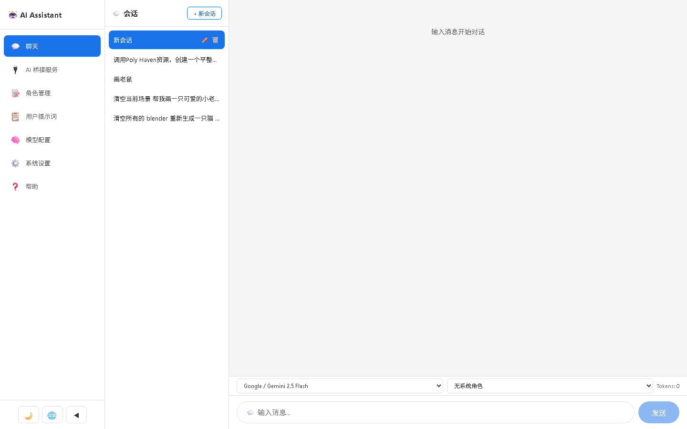
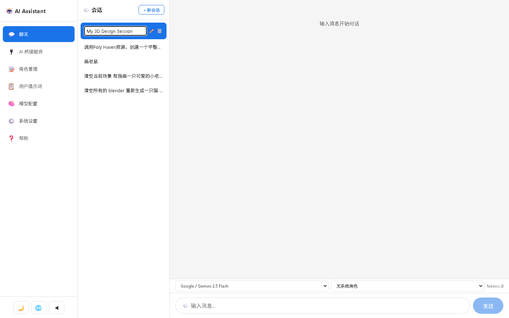
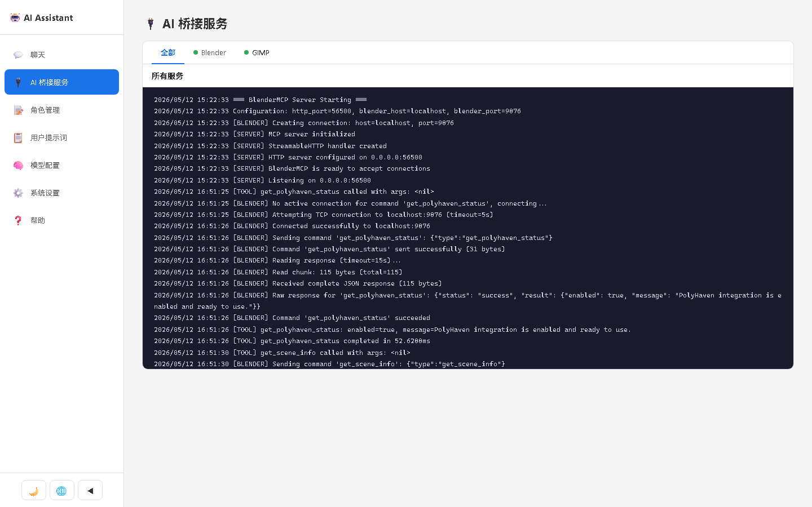
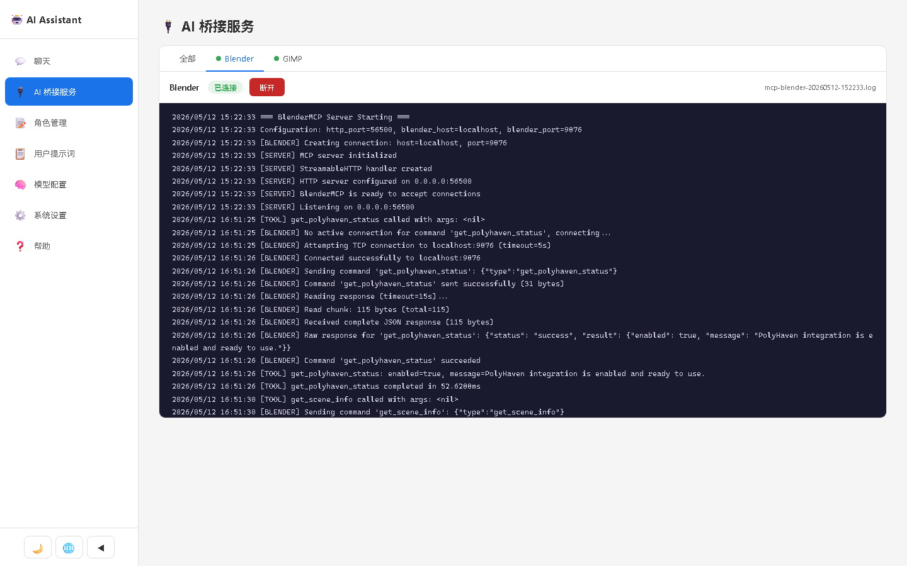
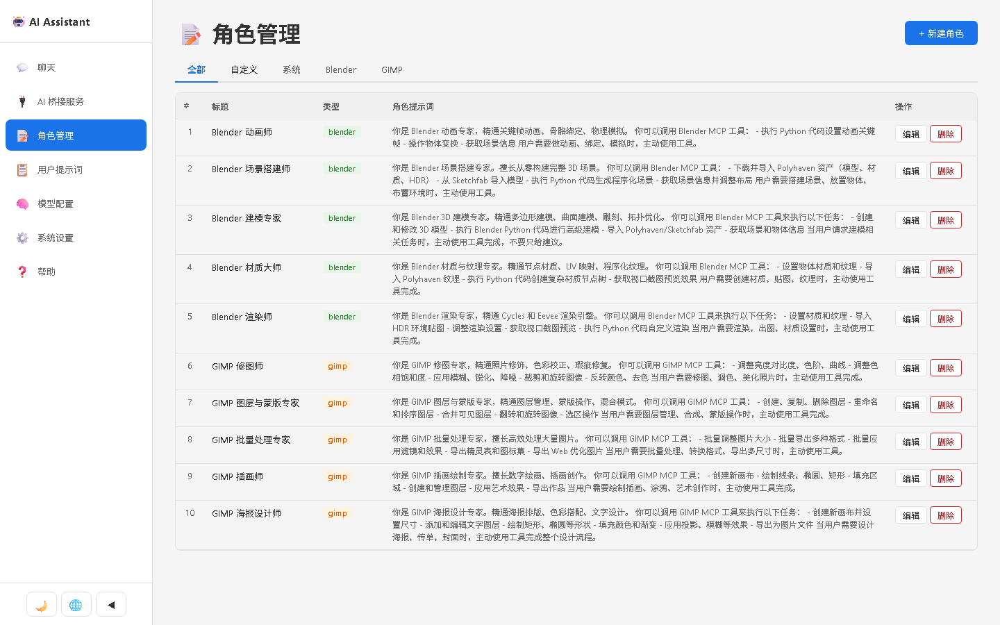
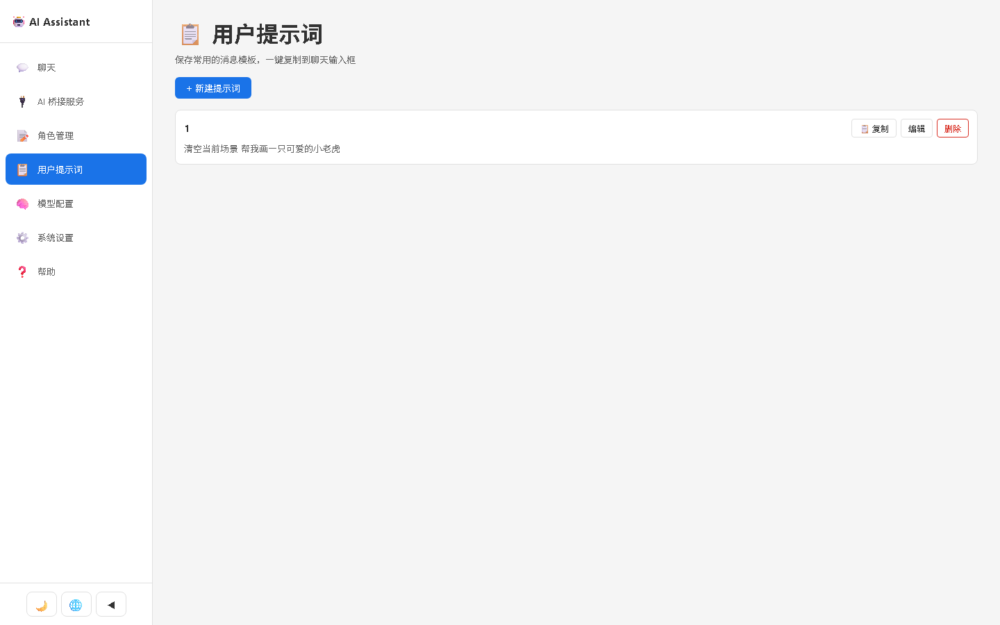
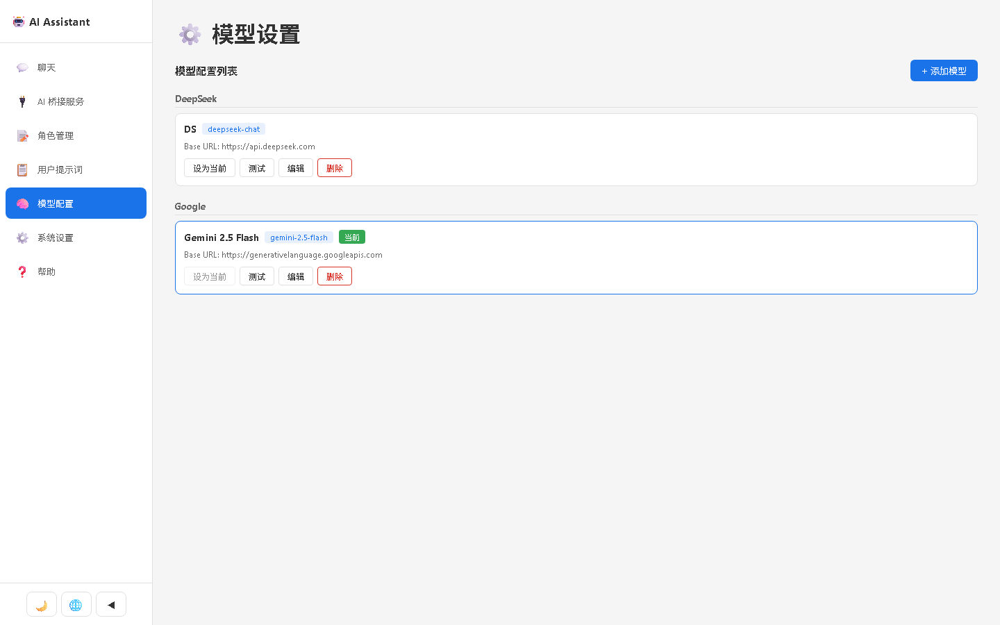
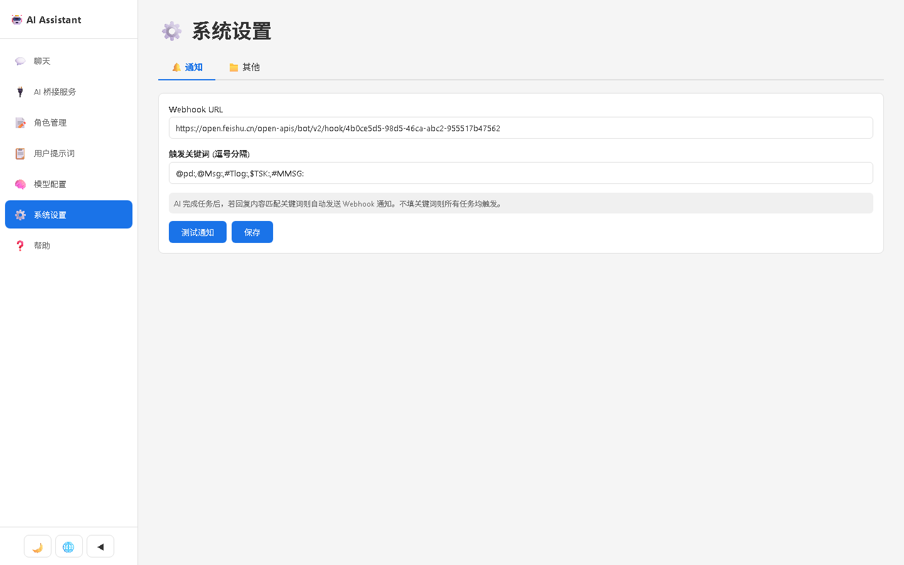
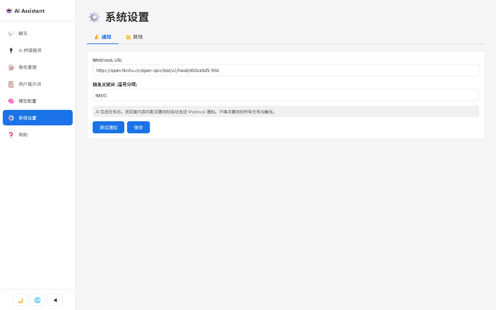
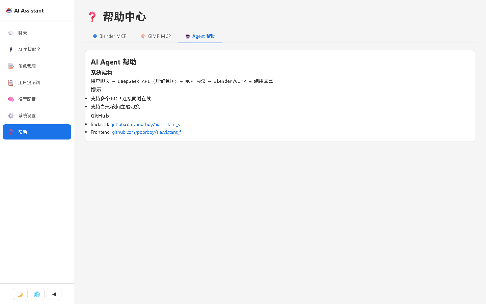

# AI Assistant — ユーザーマニュアル

[**English**](MANUAL.en.md) | [**中文**](MANUAL.zh.md)

---

## AI Assistant とは？

AI Assistant は、AI モデルとチャットできるスマートツールです。チャットだけでなく、プラグインを使って **Blender**（3D モデリング）や **GIMP**（画像編集）を操作できます。あなたが AI に指示を出すと、AI が代わりにソフトウェアを操作します。

---

## 1. チャット — AI と会話する

メイン画面です。ここで AI と会話します。

### 左サイドバー — 会話一覧

すべての会話がここに表示されます。会話ごとに履歴が保存されます。

| ボタン | 説明 |
|---|---|
| **+ New** | 新しい会話を開始 |
| **鉛筆アイコン** | 会話の名前を変更 |
| **ゴミ箱アイコン** | 会話を削除 |

### 中央 — チャットエリア

- あなたのメッセージは **右側**（青色の吹き出し）
- AI の返信は **左側**（灰色の吹き出し）
- AI の返信はリアルタイムで逐次表示されます（ストリーミング）

### 下部ツールバー

- **左のドロップダウン**：使用する AI モデルを選択（DeepSeek、GPT-4o、Claude など）
- **右のドロップダウン**：「ロール」を選択 — AI の応答スタイルを指定します（例：「3D デザイナー」、「画像編集者」）
- **トークン数**：現在のセッションの使用トークン数を表示

### 使い方

1. **+ New** をクリックして新しい会話を開始
2. 下部の入力ボックスにメッセージを入力
3. **送信** ボタンをクリック、または Enter キーを押す
4. AI の返信を待つ

> **ヒント**：自分のメッセージにマウスを乗せると、コピーと再入力のボタンが表示されます。

---

## 2. AI ブリッジ — Blender / GIMP に接続

このページでは、外部ツールとの接続を管理します。接続すると、AI があなたの指示に従って Blender や GIMP を操作できるようになります。

### 画面説明

- **タブバー**：利用可能なサービス一覧（Blender、GIMP など）
- **ステータスバッジ**：緑 = 接続済み、灰色 = 未接続
- **ログエリア**：リアルタイムの動作ログ（3秒ごとに自動更新）

### 使い方

1. サービスタブをクリックして詳細を表示
2. **接続** をクリックして接続を確立
3. 接続が完了すると、ステータスバッジが緑色に変わります
4. これでチャット中に AI がそのツールを使用できるようになります
5. 終わったら **切断** をクリック

> **ヒント**：複数のサービスに同時に接続できます！

---

## 3. ロール — AI の性格を設定する

ロールとは、AI の振る舞いを定義するシステムプロンプトです。例えば「Blender エキスパート」ロールを選ぶと、AI が 3D モデリングの専門家のように振る舞います。

### カテゴリ

| カテゴリ | 用途 |
|---|---|
| **Custom（カスタム）** | 自分で作成するロール |
| **System（システム）** | 組み込みのデフォルトロール |
| **Blender** | 3D モデリングタスク向けロール |
| **GIMP** | 画像編集タスク向けロール |

### ロールの作成方法

1. **+ New Role** をクリック
2. **タイトル** を入力（例：「Blender エキスパート」）
3. **カテゴリ** を選択
4. **内容** を記述 — AI の振る舞いを具体的に書きます
5. **保存** をクリック

### ロールの使い方

チャットページで、下部のロールドロップダウンからロールを選択します。会話中、AI はそのロールの指示に従って応答します。

### ロールの編集

テーブル上で直接編集できます。各行の **編集** ボタンをクリックするか、タイトル/内容のセルを直接クリックしてください。

> **ヒント**：カテゴリタブ（すべて/カスタム/システム/Blender/GIMP）で一覧を絞り込めます。

---

## 4. プロンプト — お気に入りのメッセージを保存

よく使うメッセージをテンプレートとして保存し、ワンクリックで再利用できます。

### 使い方

1. **+ New Prompt** をクリック
2. **タイトル** と **内容** を入力
3. **保存** をクリック
4. 使いたいときは、テンプレートの **コピー** ボタンをクリック
5. チャットページに貼り付けて送信

---

## 5. モデル — AI モデルを追加する

さまざまなプロバイダーのモデルを追加できます。よく使われるモデルはプリセットとして用意されています。

### 対応プロバイダー

DeepSeek、OpenAI（GPT-4o）、Anthropic（Claude）、Google（Gemini）、Moonshot、Alibaba（Qwen）、Baidu（ERNIE）、Tencent、Groq、Together AI、xAI、OpenRouter、Ollama（ローカル）など。

### モデルの追加方法

1. **+ Add Model** をクリック
2. **Quick fill** ボタンをクリックすると人気モデルが自動入力されます
3. または手動で入力：
   - **Provider（プロバイダー）**：モデルの提供元
   - **Name（名称）**：わかりやすい名前
   - **Model（モデル）**：モデル ID（例：deepseek-chat）
   - **Base URL**：API のアドレス
   - **API Key**：あなたの秘密キー
   - **Proxy URL**：（必要な場合）プロキシアドレス
4. **作成** をクリック

### その他の操作

| ボタン | 説明 |
|---|---|
| **Set Active** | このモデルをチャットのデフォルトに設定 |
| **Test** | 接続が正常かテスト |
| **Edit** | 設定を変更 |
| **Delete** | モデルを削除 |

---

## 6. 設定 — システム設定

### 通知設定

Webhook（例：Feishu/Lark ボット）を設定すると、AI がタスクを完了したときに通知を受け取れます。

- **Webhook URL**：通知ボットのアドレス
- **キーワード**：AI の返信に含まれていると通知を送信する単語
  - 空欄にすると、すべてのタスク完了時に通知

### その他の設定

- **Blender 作業ディレクトリ**：Blender が生成したファイルの保存先

---

## 7. ヘルプ — アプリ内ガイド

ヘルプページには 3 つのタブがあります：

| タブ | 内容 |
|---|---|
| **Blender MCP** | Blender プラグインのインストールと接続手順 |
| **GIMP MCP** | GIMP プラグインのインストールと接続手順 |
| **Agent ヘルプ** | システムの仕組みと便利なヒント |

---

## クイックスタート

1. **モデルを追加**（モデルページ）— プリセットをクリック、API Key を入力、作成、Set Active
2. **ツールに接続**（AI ブリッジページ）— Blender か GIMP の接続ボタンをクリック
3. **チャットを開始**（チャットページ）— + New をクリック、メッセージ入力、送信
4. **ロールを設定**（任意）— ドロップダウンからロールを選択して AI をガイド

---

## ナビゲーション

左サイドバーがメインメニューです。アイコンをクリックして各ページに移動します。

| アイコン | ページ |
|---|---|
| 💬 | チャット |
| 🔌 | AI ブリッジ |
| 📝 | ロール |
| 📋 | プロンプト |
| 🧠 | モデル |
| ⚙️ | 設定 |
| ❓ | ヘルプ |

サイドバー下部では、以下が可能です：
- 太陽/月ボタンで **ダーク/ライトテーマ** 切替
- 地球ボタンで **言語** 切替（EN / 中文 / 日本語）
